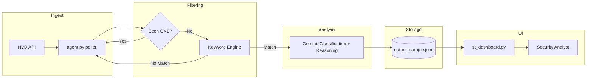

# Automated OT Threat Intelligence Agent


A lightweight Python agent that polls NVD, filters OT/ICS-relevant CVEs, asks Gemini for OT classification *and* operational reasoning in a single pass, and exposes findings via a Streamlit SOC-style dashboard.

**Interactive Dashboard:** [https://automated-threat-intelligence-agent.streamlit.app/](https://automated-threat-intelligence-agent.streamlit.app/)

---

## Repository Layout

```
.
├─ agent.py             # continuous scanner + AI classification + reasoning
├─ st_dashboard.py      # Streamlit frontend reading output_sample.json
├─ output_sample.json   # persisted validated OT alerts (sample)
├─ requirements.txt
├─ .env.example
└─ README.md
```

---

## Quick Start (Run Locally)

**Requirements:** Python 3.11+, pip

1. **Clone the repository**

```bash
git clone https://github.com/PierreRamez/Automated-Threat-Intelligence-Agent.git
cd Automated-Threat-Intelligence-Agent
```

2. **Create virtual environment & install dependencies**

```bash
python -m venv .venv && source .venv/bin/activate
pip install -r requirements.txt
```

3. **Configure environment variables**

Create a `.env` file in the root directory:

```env
NVD_API_KEY=your_nvd_api_key_here
GEMINI_API_KEY=your_google_ai_key_here
```

4. **Run the backend agent** (keep this running)

```bash
python agent.py
```

5. **Launch the Streamlit dashboard** (new terminal)

```bash
streamlit run st_dashboard.py
```

**Notes**

- `agent.py` polls NVD on a fixed 10-minute interval and writes results to `output_sample.json`.
- `st_dashboard.py` reads directly from this file and renders the UI.
- The polling interval and output path are currently hardcoded in the script.

---

## System Pipeline Overview

1. **Ingestion** – Query NVD for newly published CVEs.
2. **Deduplication** – Skip CVEs already processed using an in-memory cache.
3. **Keyword Filtering** – Fast lexical scan for OT-specific vendors, protocols, and assets.
4. **AI Analysis** – Gemini classifies OT relevance and explains operational impact in a single request.
5. **Persistence** – Structured results appended to JSON storage.
6. **Visualization** – Streamlit dashboard presents metrics and analyst-friendly views.

---

## Prompt Design & Decision Logic

The agent uses a **single-shot prompt** via **Gemini 2.5 Flash Lite** to maximize efficiency and simplicity. In one call, the model is asked to both classify the CVE and, if applicable, explain the risk to industrial systems.

### Combined Prompt Structure

```text
You are an expert OT threat analyst with 160 IQ.
Thoroughly analyze the following CVE description.
ONLY a JSON object with exactly these keys:
    1. "ot_related" : boolean (True if OT/ICS/SCADA related, False otherwise).
    2. "reason" : string (an expert-level, detailed explanation of why. If "ot_related" is True, explain why this vulnerability is dangerous).

---------------------
Description:
---------------------
{description}
```

&#x20;  &#x20;

&#x20;   **Why this approach?**

- **Low Latency:** A single API call per CVE minimizes end-to-end processing time.
- **Cost Efficient:** Uses the lightweight Flash Lite model without additional follow-up calls.
- **Simplicity:** Reduces prompt orchestration complexity and failure modes.

---

## Architecture Diagram



---

## Technical Design Details

- **Keyword Engine:** Curated OT dictionary (\~50+ terms) tuned for high recall on ICS vendors and protocols.
- **LLM Usage:** Single deterministic request per candidate CVE; strict JSON parsing of the response.
- **Rate Handling:** Basic retry logic around API calls; fixed polling interval.
- **Fault Tolerance:** JSON read/write wrapped in exception handling to avoid dashboard crashes.
- **Secrets Management:** All API keys are loaded from environment variables.

---

## Example Output Schema

```json
{
  "cve_id": "CVE-2026-0528",
  "cvss": 6.5,
  "severity": "MEDIUM",
  "description": "Improper Validation of Array Index in Metricbeat...",
  "ai_insight": "This CVE impacts Metricbeat. In an OT context, this could disrupt the collection of operational telemetry from SCADA or industrial monitoring systems, affecting visibility and response."
}
```

---

## Security & Privacy Considerations

- Only public CVE metadata is sent to the Gemini API.
- No internal asset identifiers or operational telemetry are exposed.
- API keys are excluded from version control and should be rotated periodically.

---

## Known Limitations & Honest Tradeoffs

- **Single-pass AI analysis:** Classification and reasoning are coupled; false positives require manual review.
- **Hardcoded configuration:** Polling interval and output path are not externally configurable yet.
- **JSON storage:** Simple and portable, but not designed for concurrent writes or scaling.

---

## Design Philosophy

- **Operational Impact over CVSS:** The system prioritizes *context* (OT relevance) over raw scores, acknowledging that a "Medium" severity CVE can still shut down a factory.
- **Intentional Simplicity:** By avoiding complex databases or microservices for this prototype, the system reduces failure modes and ensures reliability during the evaluation.
- **Future Roadmap:** The architecture allows for a clear upgrade path to two-stage prompting, external configuration, and SQLite storage without rewriting the core logic.

---

This project demonstrates an end-to-end OT-focused threat intelligence prototype with realistic scope, clear limitations, and a strong foundation for iteration.

